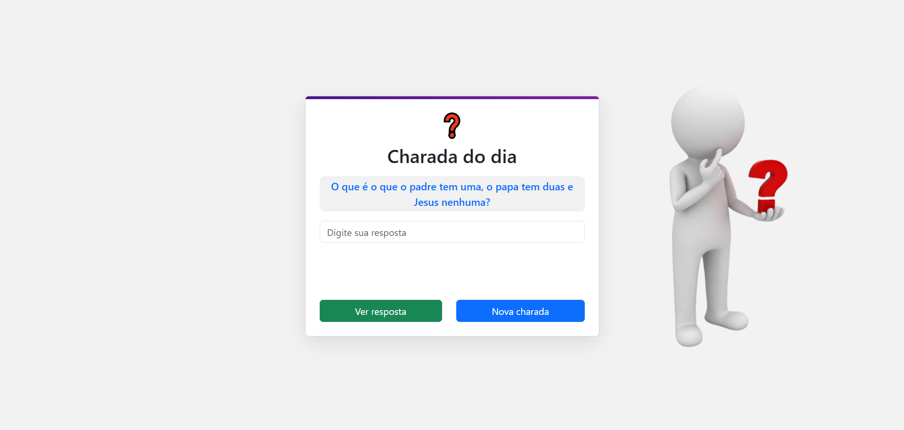

## Curso de desenvolvimento de sistemas - SENAI-SP

**Descrição:**
Este programa utiliza a API charadas, criada no curso de desenvolvimento de sistemas, ele puxa uma charada aleatória dentro do banco de dados e mostra uma charada na tela, você tem que tentar resolve-la.
## Índice

* [Funcionalidades](#Funcionalidades)
* [Tecnologias](#Tecnologias)
* [Autores](#Autores)
* [Licença](#Licença)

## Funcionalidades
* Puxa uma charada do banco de dados para o usuário ver
* Permite o usuário responder a charada
* Mostra a resposta da charada e se o usuário acertou ou não
* Permite a opção de receber uma nova charada

## Tecnologias
### Front-End

### Back-End

### APIs
https://back-charada-api.vercel.app/

### Deploy
https://vercel.com/

## Autores
Matheus Wincler Santos

https://github.com/Matheus2614

https://www.linkedin.com/in/matheus-wincler-968439315/

## Licença
Este arquivo está licenciado pela licença MIT - Veja o arquivo LICENSE para mais detalhes